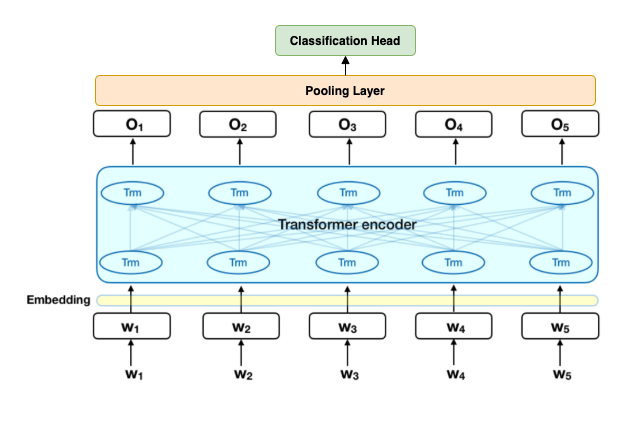

# Emotion-Transformer
Emotion Detection with Transformer models 😃😡😱😊!

# Model Architecture

<div style="text-align:center"></div>

Our model is built on top of a pretrained Transformer model such as RoBERTa. To get a sentence representation we apply a pooling technique (average, max or CLS) and pass that representation to a classification head that produces an independent score for each label.


# Install

```bash
virtualenv -p python3.6 emot-env
source emot-env/bin/activate

https://github.com/HLT-MAIA/Emotion-Transformer
cd Emotion-Transformer
pip install -r requirements.txt
```

## Command Line Interface:

### Train:

To set up your training you have to define your model configs. Take a look at the `example.yaml` in the configs folder, where all hyperparameters are briefly described.

After defining your hyperparameter run the following command:
```bash
python cli.py train -f configs/example.yaml
```

### Monitor training with Tensorboard:
Launch tensorboard with:

```
tensorboard --logdir="experiments/"
```


## Interact:
Fun command where we can interact with with a trained model.

```bash
python cli.py interact --experiment experiments/{experiment_id}/
```